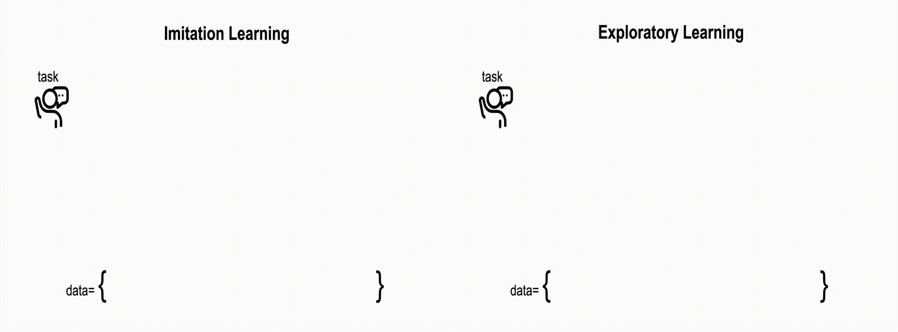

# Teaching AI Agents to Search with Reflective-MCTS and Exploratory Learning

[[Website]](https://agent-e3.github.io/rmcts-exploratory-learning/)
[[arXiv]](https://arxiv.org/abs/2410.02052)

We present R-MCTS and Exploratory Learning for building o1-like models for agentic applications. Our **R-MCTS agent** extends traditional MCTS by 1) incorporating contrastive reflection, allowing agents to learn from past interactions and dynamically improve their search efficiency; and 2) using multi-agent debate to provide reliable state evaluation.


**Exploratory Learning** is a novel learning strategy that trains the models to explore the environment, evaluate a state, and backtrack to viable ones when it detects that the current state cannot lead to success. Our GPT-4o powered R-MCTS agent creates SOTA performance on VisualWebArena. Notably, R-MCTS and Exploratory Learning demonstrate the compute scaling properties in both training and testing time.



# TODOs

Codebase coming soon!

# Citation

If you methods or code useful, please consider citing our paper:

```bash
@misc{yu2024teachingaiagentssearch,
      title={Teaching AI Agents to Search with Reflective-MCTS and Exploratory Learning}, 
      author={Xiao Yu and Baolin Peng and Vineeth Vajipey and Hao Cheng and Michel Galley and Jianfeng Gao and Zhou Yu},
      year={2024},
      eprint={2410.02052},
      archivePrefix={arXiv},
      primaryClass={cs.CL},
      url={https://arxiv.org/abs/2410.02052}, 
}
```

# Acknowledgements

Our code is heavily based off the [VisualWebArena](https://github.com/web-arena-x/visualwebarena) codebase and the [SearchAgent](https://github.com/kohjingyu/search-agents) codebase.